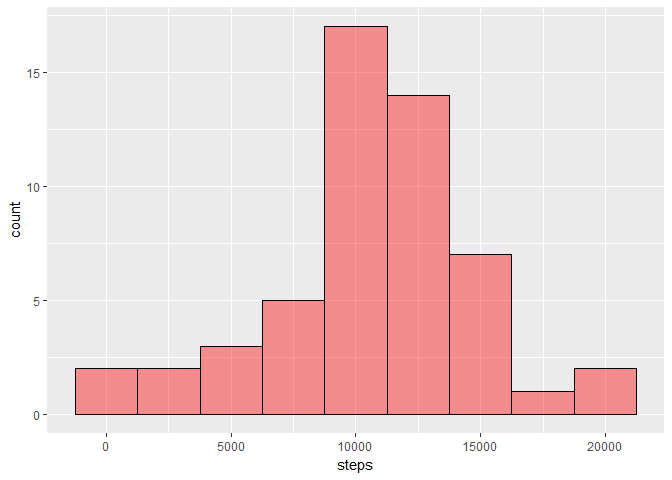
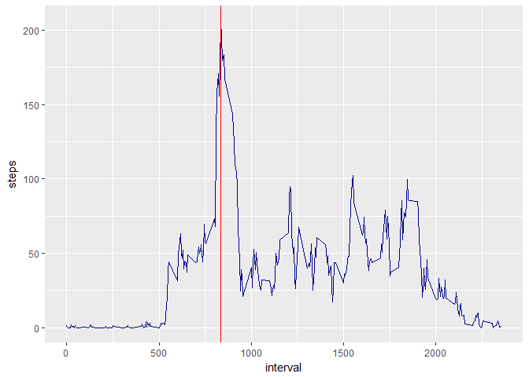
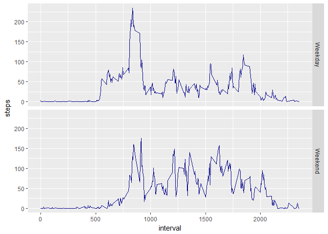

## Loading and preprocessing the data

First, we are gonna set our constants and check if the working directory exists. Then we'll set our working environment.

```r
#Here, you can change the working directory
MAIN_DIRECTORY <- "C:/Project1ReproducibleResearch";
DATA_URL <- "https://d396qusza40orc.cloudfront.net/repdata%2Fdata%2Factivity.zip";
DATA_ZIP_FILE <- "activity.zip";
DATA_UNZIP_DIRECTORY <- "activity_data";
DATA_FILE <- "activity.csv";

#Verifying if main directory exists.
if(!file.exists(MAIN_DIRECTORY)){ dir.create(MAIN_DIRECTORY); }
setwd(MAIN_DIRECTORY);
```

Then we'll download the data and then load the data into dataframe.

```r
#Verifying if data file exists.
if(!file.exists(DATA_ZIP_FILE)){
  download.file(DATA_URL, DATA_ZIP_FILE);
}
#Verifying if directory exists.
if(!file.exists(DATA_UNZIP_DIRECTORY)){
  unzip(DATA_ZIP_FILE, exdir = DATA_UNZIP_DIRECTORY);
}

#Read csv data
activity_data <- read.csv(file.path(DATA_UNZIP_DIRECTORY, DATA_FILE));

#Cast the date attribute
activity_data$date <- as.Date(activity_data$date);
```

Let's show how the data looks like

```r
head(activity_data);
```

```
##   steps       date interval
## 1    NA 2012-10-01        0
## 2    NA 2012-10-01        5
## 3    NA 2012-10-01       10
## 4    NA 2012-10-01       15
## 5    NA 2012-10-01       20
## 6    NA 2012-10-01       25
```

## What is mean total number of steps taken per day?
We want to figure out how many steps take a person per day. Our analysis will sum the steps by date, and then we'll find the mean and the median of the data. 

```
## Warning: package 'ggplot2' was built under R version 3.4.2
```

Let's plot a histogram for steps by day.

```r
#Sum all steps by date
aggregated_data <- aggregate(steps~date, activity_data, sum);

#Plotting the histogram
g <- ggplot(aggregated_data, aes(x=steps));
g  + geom_histogram(binwidth=2500, colour="black", fill="red", alpha = .4);
```

<!-- -->

With the previous histogram we can see that usually a person registers about 10000 steps each day.

Now, we'll show you the mean and the median of steps taken per day.

```r
#Mean calculation
mean(aggregated_data$steps);
```

```
## [1] 10766.19
```

```r
#Median calculation
median(aggregated_data$steps);
```

```
## [1] 10765
```
With the previous calcultation we can confirm that a person registers about 10000 steps by day with this data set.


## What is the average daily activity pattern?

Now, we want figure out how is the activity pattern across the day. And which interval has the max number of steps.

Let's plot the activity patern over a timeline

```r
#Getting the meaning of steps by interval
aggregated_data <- aggregate(steps~interval, activity_data, mean);

#Plotting the timeline
g <- ggplot(aggregated_data, aes(x = interval, y = steps));
g + geom_line(colour="darkblue") +
  #Vertical line to see the max
  geom_vline(xintercept = aggregated_data[which.max(aggregated_data$steps),]$interval, colour = "red");
```

<!-- -->

We can see that the vertical line show us that the max number of steps is almost on 800. We can confirm it:

```r
aggregated_data[which.max(aggregated_data$steps),];
```

```
##     interval    steps
## 104      835 206.1698
```

We can see that the max number of steps is about 206, and that occur on interval 835.

## Imputing missing values
We can notice that the data contains some missing values for steps variable.

```r
summary(activity_data$steps);
```

```
##    Min. 1st Qu.  Median    Mean 3rd Qu.    Max.    NA's 
##    0.00    0.00    0.00   37.38   12.00  806.00    2304
```
We can see  that we have 2304 rows with missing values.

Let's fill this values with the mean by interval

```r
#Copy of activity data
activity_data_copy <- activity_data;

#Calculation of mean of steps by interval.
aggregated_data <- aggregate(steps~interval, activity_data_copy, mean);
#Changing the row names by interval.
row.names(aggregated_data) <- aggregated_data$interval;
#Filling the missing values.
activity_data_copy[is.na(activity_data_copy$steps),]$steps <- round(aggregated_data[as.character(activity_data_copy[is.na(activity_data_copy$steps),'interval']),'steps']);

summary(activity_data_copy$steps);
```

```
##    Min. 1st Qu.  Median    Mean 3rd Qu.    Max. 
##    0.00    0.00    0.00   37.38   27.00  806.00
```

We can see now it doesn't have missing values for steps variable.

Let's compare the two histograms (previous with missing values against the new without missing values)

```r
#Calculation of steps by date
aggregated_data <- aggregate(steps~date, activity_data, sum);
aggregated_data_copy <- aggregate(steps~date, activity_data_copy, sum);

#Plotting the data
g <- ggplot(aggregated_data, aes(x=steps));
g  +  geom_histogram(binwidth=2500, colour="black", fill="black", alpha = .4) + 
      geom_histogram(data = aggregated_data_copy, binwidth = 2500, fill = "green", colour="green", alpha = .3);
```

<!-- -->

With the plot we figure out that filling the missing values will have a great impact over the values where the steps is about 10000.

## Are there differences in activity patterns between weekdays and weekends?
Now we want to figure out how change the activity pattern on weekends against weekdays.

Let's plot the timeline.

```r
#Calculation of mean by interval and type of day (Weekend or Weekday)
activity_data$day <- ifelse(grepl("S(at|un)", weekdays(activity_data$date)), "Weekend", "Weekday");
activity_data$day <- factor(activity_data$day);
aggregated_data <- aggregate(steps~interval + day, activity_data, mean);

#Plotting the data
g <- ggplot(aggregated_data, aes(x = interval, y = steps));
g + geom_line(colour="darkblue") + facet_grid(day~.)
```

<!-- -->

We can see that in weekends the activity is most spread than weekdays. But we have the highest value in weekdays, a good reason could be that in weekdays we have to do a lot of activity to get at workplace.
